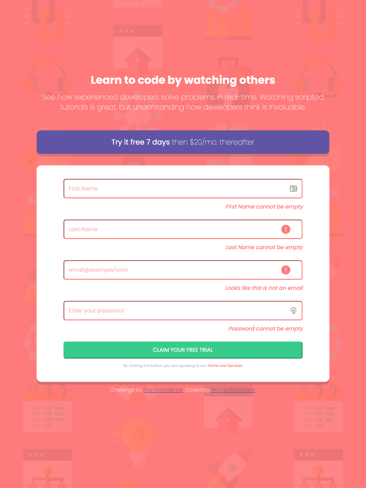

# Frontend Mentor - Intro component with sign up form solution

This is my solution to the [Intro component with sign up form challenge on Frontend Mentor](https://www.frontendmentor.io/challenges/intro-component-with-signup-form-5cf91bd49edda32581d28fd1). Frontend Mentor challenges help you improve your coding skills by building realistic projects. 

## Table of contents

- [Overview](#overview)
  - [The challenge](#the-challenge)
  - [Screenshot](#screenshot)
  - [Links](#links)
- [My process](#my-process)
  - [Built with](#built-with)
  - [What I learned](#what-i-learned)
  - [Continued development](#continued-development)
  - [Useful resources](#useful-resources)
- [Author](#author)
- [Acknowledgments](#acknowledgments)

## Overview

### The challenge

Users should be able to:

- View the optimal layout for the site depending on their device's screen size
- See hover states for all interactive elements on the page
- Receive an error message when the `form` is submitted if:
  - Any `input` field is empty. The message for this error should say *"[Field Name] cannot be empty"*
  - The email address is not formatted correctly (i.e. a correct email address should have this structure: `name@host.tld`). The message for this error should say *"Looks like this is not an email"*

### Screenshot

This screenshot was taken in Firefox.  The error icons do not show in the First Name and Password fields because I have a password manager that is inserting it's own icons.

### Links

- My Solution URL: (https://github.com/Brenda-CW/intro-component-with-signup-form)
- Live Site URL: (https://brenda-cw.github.io/intro-component-with-signup-form/)

## My process

### Built with

- Semantic HTML5 markup
- CSS custom properties
- Flexbox
- Mobile-first workflow
- Vanilla JS

### What I learned

This project pulled together what I have learned through Skillcrush and put my knowledge into action.  All code was written by me with some helpful guidance from members of the Frontend Mentor community.  

### Continued development

Going forward, I would like to recode this using React. Working with images always seems to give me some challenge, whether it's syntax or location or it just not working as I expect.  This project gave me several opportunities to review and practice.  

### Useful resources

- [Background Image resource ](https://www.w3docs.com/snippets/css/how-to-add-background-image.html) - This helped me recall all the various values needed to get the image to act as I wanted it to. 
- [CSS :invalid resource ](https://www.w3schools.com/csSref/sel_invalid.asp) - While this was suggested as a way to trigger the error alerts and icons, it helped me understand that it would really only work for the email field and not the text fields. I didn't end up using it in this project yet I found it helpful to know about and understand.
- [Email validation resource ](https://www.w3resource.com/javascript/form/email-validation.php) - While I figured out a basic way in JS to check for @ and .com in the email field, I realized that this would not accept other domains like .net or .org.  The W3 resource gave me what I needed to validate email more thoroughly.

## Author

- Website - [Brenda Whetstone](https://devbybrenda.com)
- Frontend Mentor - [@Brenda-CW](https://www.frontendmentor.io/profile/Brenda-CW)

**Note: Delete this note and add/remove/edit lines above based on what links you'd like to share.**

## Acknowledgments

Thanks to Grace Snow & Mustafa Baker from the Frontend Mentor community for their thoughts and suggestions that helped me work through challenges and get everything working.

